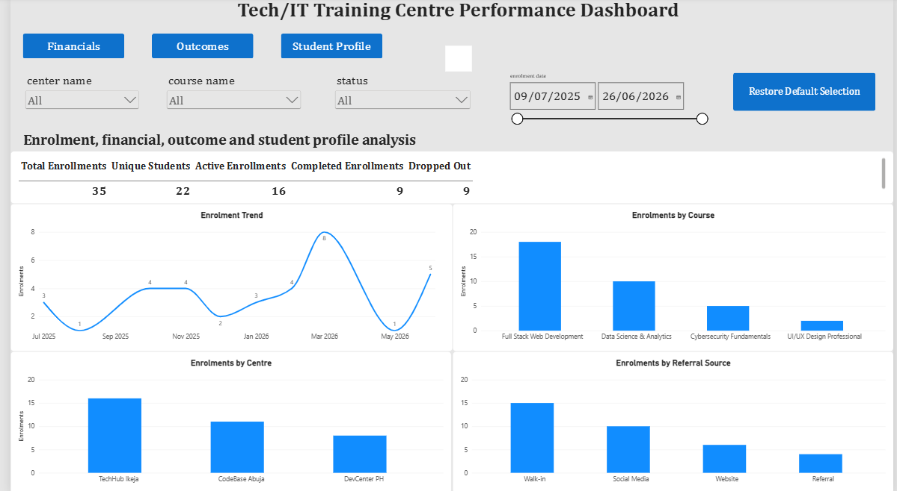
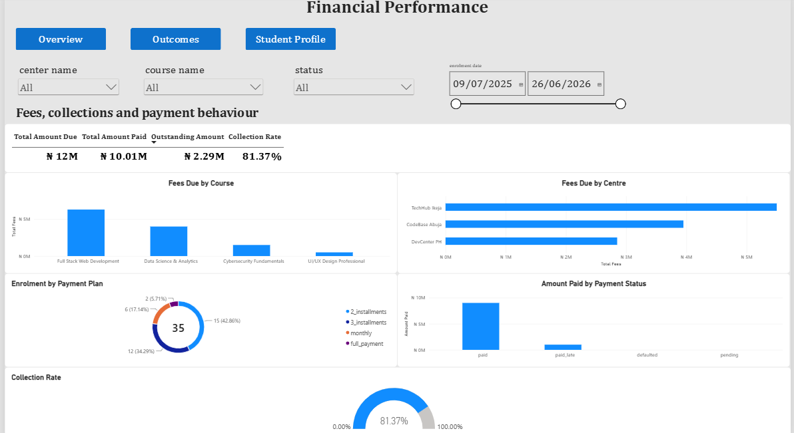
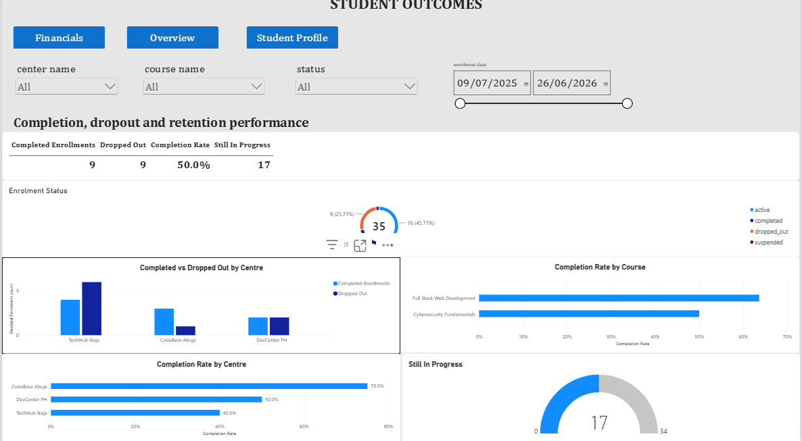
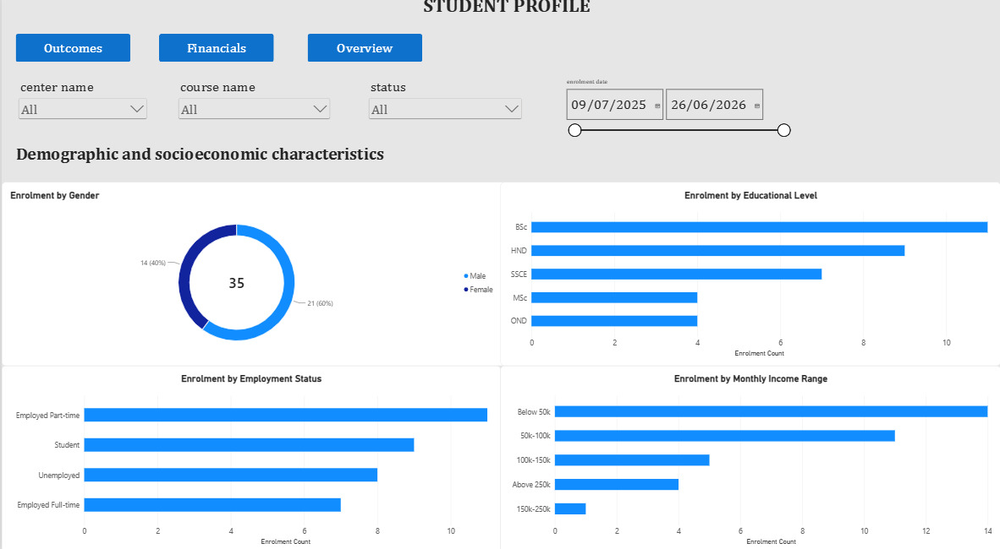

# Tech/IT Training Center Performance Analysis

## Project Overview

This project analyzes enrollment, student, payment, course, and training center data for a fictional multi-center technology training business.

The goal is to understand enrollment performance, financial collection, student outcomes, and learner characteristics, then turn those findings into practical business recommendations.

The project follows a complete analytics workflow:

**SQL → Python → Excel → Power BI → Business Recommendations**

---

## Business Questions

The analysis focuses on questions such as:

1. How are enrollments distributed across centers and courses?
2. Which courses and centers attract the most students?
3. How much revenue is due, collected, and outstanding?
4. What proportion of decided enrollments are completed or dropped out?
5. How do student outcomes differ across centers and courses?
6. Which payment plans are most commonly used?
7. What are the main demographic and employment characteristics of students?
8. What areas should management investigate to improve enrollment, retention, and financial performance?

---

## Tools Used

* **MySQL** — data exploration, joins, aggregation, and business analysis
* **Python / Pandas** — data cleaning, validation, transformation, and analysis
* **Matplotlib** — exploratory visualizations
* **Excel** — management report and KPI analysis
* **Power BI** — interactive business dashboard
* **Git / GitHub** — version control and portfolio presentation

---

## Executive Summary

The dataset contains **35 enrollments** across three training centers and four technology courses.

### Key KPIs

| KPI                |         Result |
| ------------------ | -------------: |
| Total Enrollments  |             35 |
| Unique Students    |             22 |
| Active Enrollments |             16 |
| Completed          |              9 |
| Dropped Out        |              9 |
| Decided Outcomes   |             18 |
| Still In Progress  |             17 |
| Completion Rate    |            50% |
| Dropout Rate       |            50% |
| Total Fees Due     |    ₦12,300,000 |
| Total Amount Paid  | ₦10,008,802.28 |
| Outstanding Amount |  ₦2,291,197.72 |
| Collection Rate    |         81.37% |

The results show strong enrollment activity and an overall collection rate of 81.37%, but there is also a significant outstanding balance and an equal number of completed and dropped-out students among decided outcomes.

Because 17 of the 35 enrollments are still in progress, outcome rates should be interpreted using the **18 decided enrollments** rather than the entire enrollment population.

---

## Dashboard Preview

### Overview



### Financial Performance



### Student Outcomes



### Student Profile



---

## Business Insights

### 1. Enrollment is concentrated in a small number of courses and centers

Full Stack Web Development accounts for **18 of the 35 enrollments**, while TechHub Ikeja has **16 of the 35 enrollments**.

This concentration may create dependency on particular courses or locations. Management should understand what is driving this demand and determine whether successful practices can be replicated across other centers and courses.

### 2. Financial collection is relatively strong, but a significant balance remains outstanding

The business has **₦12.3 million in total fees due** and has collected **₦10,008,802.28**, giving an overall collection rate of **81.37%**.

However, **₦2,291,197.72 remains outstanding**. Payment monitoring and follow-up therefore remain important areas for management attention.

### 3. Completion and dropout are evenly split among decided outcomes

Among the **18 decided enrollments**, there are:

* 9 completed
* 9 dropped out

This produces a **50% completion rate and 50% dropout rate** among decided outcomes.

However, 17 enrollments are still active or suspended, meaning the current outcome picture is not yet final for the entire enrollment population.

### 4. Completion rates vary across training centers

Among decided outcomes:

| Center         | Completion Rate |
| -------------- | --------------: |
| CodeBase Abuja |             75% |
| DevCenter PH   |             50% |
| TechHub Ikeja  |             40% |

These differences should not automatically be interpreted as evidence that one center performs better than another.

The decided groups are relatively small, so management should investigate factors such as course mix, student characteristics, payment behavior, learner support, and operational differences.

### 5. Walk-in and social media referrals generate the largest enrollment volumes

Enrollment sources are:

| Referral Source | Enrollments |
| --------------- | ----------: |
| Walk-in         |          15 |
| Social Media    |          10 |
| Website         |           6 |
| Referral        |           4 |

Enrollment volume alone does not establish which channel is most valuable.

Management should compare referral sources using additional measures such as completion, dropout, payment performance, and acquisition cost.

### 6. Two-installment and three-installment plans are the most common

Payment plan adoption is:

| Payment Plan   | Enrollments |
| -------------- | ----------: |
| 2 Installments |          15 |
| 3 Installments |          12 |
| Monthly        |           6 |
| Full Payment   |           2 |

The popularity of a payment plan does not necessarily mean it is the most effective option for the business or students.

Payment performance should be compared across plans to identify whether certain structures are associated with stronger or weaker collection behavior.

### 7. Course completion results require further investigation

Among decided outcomes:

| Course                     | Completion Rate |
| -------------------------- | --------------: |
| Full Stack Web Development |             64% |
| Cybersecurity Fundamentals |             50% |
| Data Science & Analytics   |              0% |
| UI/UX Design Professional  |              0% |

The results for Data Science and UI/UX should be interpreted cautiously because their decided populations are much smaller.

Rather than immediately concluding that these courses perform poorly, management should investigate enrollment volume, student characteristics, course difficulty, learner support, attendance, and other possible factors.

---

## Business Recommendations

### 1. Reduce concentration risk

Review why Full Stack Web Development and TechHub Ikeja attract a large proportion of enrollments.

Identify successful practices that could potentially be applied to other courses and centers.

### 2. Strengthen payment monitoring

Implement regular tracking of outstanding balances, overdue payments, and upcoming installments.

Prioritize follow-up for students with overdue balances while maintaining appropriate communication with active students.

### 3. Investigate dropout drivers

Because completed and dropped-out enrollments are currently equal among decided outcomes, management should investigate why students leave.

Useful additional information would include attendance, academic performance, satisfaction, payment difficulties, and recorded dropout reasons.

### 4. Investigate center-level differences

Compare centers using a broader set of indicators rather than completion rate alone.

This could include:

* Enrollment volume
* Dropout rate
* Payment collection
* Course mix
* Student characteristics
* Learner support
* Staff performance

### 5. Evaluate referral channels by quality, not only volume

Track the full journey from acquisition to completion and payment.

A lower-volume channel could potentially be more valuable if it produces students with stronger completion and payment outcomes.

### 6. Review payment-plan performance

Compare payment plans based on collection rate, overdue payments, and outstanding balances.

This can help determine whether payment structures should be adjusted for particular student groups or centers.

### 7. Collect more operational data

Future analysis would benefit from variables such as attendance, satisfaction, academic performance, marketing spend, acquisition cost, and dropout reasons.

These variables would provide stronger evidence for explaining student outcomes.

---

## Project Limitations

This analysis has several limitations:

* The dataset contains only **35 enrollments**, so results should not be generalized without additional data.
* **17 enrollments are still active or suspended**, meaning their final outcomes are not yet known.
* The dataset covers approximately one year of enrollment activity.
* Important explanatory variables such as attendance, satisfaction, academic performance, marketing spend, and dropout reasons are not available.
* The analysis identifies patterns and relationships but does not establish causation.
* Payment data operates at a different grain from enrollment data and therefore requires separate aggregation before being combined with enrollment-level analysis.
* Larger and more historical datasets would provide a stronger basis for trend analysis and business decisions.

---

## Project Workflow

### 1. Data Preparation

Raw CSV files were inspected for:

* Missing values
* Duplicate records
* Data types
* Key relationships
* Table grain
* Data consistency

### 2. SQL Analysis

MySQL was used to:

* Join related tables
* Aggregate enrollment and payment information
* Analyze course and center performance
* Examine student outcomes
* Calculate financial metrics
* Answer business questions

SQL analysis is available in:

`sql/training_center_analysis.sql`

### 3. Python Analysis

Python and Pandas were used for:

* Data cleaning
* Data validation
* Data transformation
* Dataset integration
* Exploratory analysis
* Analytical feature creation

The main notebook is:

`notebook/training_center_analysis.ipynb`

### 4. Excel Reporting

An Excel report was created to provide a structured management view of the business performance.

File:

`excel/training_center_dashboard_final.xlsx`

### 5. Power BI Dashboard

The Power BI report provides interactive views of:

* Overall performance
* Financial performance
* Student outcomes
* Student profile

File:

`powerbi/Tech_IT_Training_Center_Performance_Dashboard.pbix`

---

## Repository Structure

```text
Tech-IT-Training-Center-Performance-Analysis/
│
├── .gitignore
├── README.md
│
├── data/
│   ├── raw/
│   │   ├── tech_it_enrollments.csv
│   │   ├── tech_it_students.csv
│   │   ├── tech_it_payments.csv
│   │   ├── tech_it_centers.csv
│   │   └── tech_it_courses.csv
│   │
│   └── processed/
│       └── enrollment_analysis.csv
│
├── notebook/
│   └── training_center_analysis.ipynb
│
├── sql/
│   └── training_center_analysis.sql
│
├── excel/
│   └── training_center_dashboard_final.xlsx
│
├── powerbi/
│   └── Tech_IT_Training_Center_Performance_Dashboard.pbix
│
└── images/
    ├── overview.png
    ├── financials.png
    ├── outcomes.png
    └── student_profile.png
```

---

## How to Reproduce

### 1. Clone the repository

```bash
git clone https://github.com/Richie-O/Tech-IT-Training-Center-Performance-Analysis.git
```

### 2. Open the project

Open the project folder in VS Code or another development environment.

### 3. Run the Python notebook

Open:

```text
notebook/training_center_analysis.ipynb
```

Run the notebook from the beginning to reproduce the Python analysis.

### 4. Review the SQL analysis

Open:

```text
sql/training_center_analysis.sql
```

The queries can be executed in MySQL against the project database.

### 5. Open the Excel report

Open:

```text
excel/training_center_dashboard_final.xlsx
```

### 6. Open the Power BI report

Open:

```text
powerbi/Tech_IT_Training_Center_Performance_Dashboard.pbix
```

---

## Key Analytical Considerations

### Enrollment Grain

The main enrollment dataset has a grain of **one row per enrollment**.

This grain is used for enrollment-level KPIs and outcome analysis.

### Payment Grain

The payment dataset has a grain of **one row per payment/installment**.

Payment-level data should therefore be aggregated to the enrollment level before being combined with enrollment-level metrics.

### Outcome Denominator

Completion and dropout rates are calculated using only decided outcomes:

**Completed + Dropped Out = 18 enrollments**

Active and suspended enrollments are excluded because their final outcomes have not yet been determined.

### Interpretation

The analysis is intended to support business investigation and decision-making rather than claim causality.

Where the dataset is small or outcomes are still incomplete, findings are presented as areas for investigation rather than definitive explanations.

---

## Conclusion

This project demonstrates an end-to-end business analytics workflow, from raw operational data through SQL analysis, Python data preparation, Excel reporting, Power BI visualization, and business recommendations.

The main objective is not simply to produce dashboards, but to demonstrate how an analyst can move from **business questions → data → analysis → insights → recommendations**.
